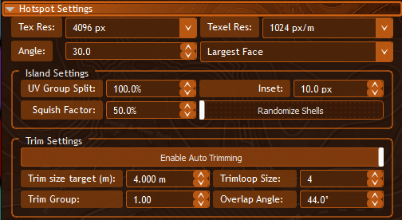

# Hotspot

The Hotspot tool automatically assigns trim sheet regions to faces based on their world-space size. Instead of manually picking trims for every surface, Hotspot analyzes your selection and matches each face group to the best-fitting trim.

## How It Works

1. Select faces on an Editable Poly object.
2. Configure your Hotspot settings (see below).
3. Click **Run Hotspot**.

Hotspot groups connected faces by angle, measures each island's UV area in world space, and projects UVs using either the **Largest Face** normal or a **Target Texel** density match. It then assigns each group to the closest trim entry by size. The result is consistent, properly-scaled trim mapping across your entire selection.

## Hotspot Settings

| Setting | Description |
|---------|-------------|
| **Tex Res** | Texture resolution of your trim sheet (e.g. 4096 px) |
| **Texel Res** | Target texel density in pixels per meter. Higher values = more detail |
| **Angle** | Maximum angle between face normals to group them as one island. Lower values create more, smaller groups |
| **Projection** | How trims are projected — **Largest Face** (uses the largest face's normal) or **Target Texel** (matches based on texel density target) |

### Island Settings

| Setting | Description |
|---------|-------------|
| **UV Group Split** | Threshold for splitting UV groups (percentage) |
| **Inset** | Pixel inset from trim edges. Prevents texture bleeding at UV borders |
| **Squish Factor** | Controls how much UV shells can be compressed to fit the target trim |
| **Randomize Shells** | Randomly varies shell placement within the trim region for visual variety |

### Trim Settings

| Setting | Description |
|---------|-------------|
| **Enable Auto Trimming** | Automatically assigns trims to face groups during hotspot processing |
| **Trim Size Target** | Target world-space size for trim matching (in meters) |
| **Trimloop Size** | Number of trim loops to use |
| **Trim Group** | Grouping factor for trim assignment |
| **Overlap Angle** | Maximum angle for overlapping trim regions |

## Material ID Assignment

Use modifier keys when clicking **Run Hotspot** to assign a specific Material ID to the processed faces:

| Modifier | Material ID Applied |
|----------|-------------------|
| **Shift + click** | Primary Material ID |
| **Ctrl + click** | Secondary Material ID |
| **Alt + click** | Tertiary Material ID |
| **No modifier** | No Material ID change (uses existing IDs) |

The Primary, Secondary, and Tertiary values are set in the Materials panel and are automatically populated from the loaded trim set's metadata. An **Override** toggle lets you switch between the set's default values and custom override values.

## Progress & Performance

- Progress displays as numbered steps: (1/4), (2/4), (3/4), (4/4)
- Hotspot operates on your **selected faces only**, not the whole mesh — small selections on complex meshes are significantly faster
- A **5-minute safety timeout** prevents runaway operations. A countdown is visible during processing
- Cancel at any time with the Cancel button — processing stops cleanly without corrupting your mesh

## Per-Set Processing (Multi-Set Mode)

When using [[Quick-Sets]] in multi-set mode, each loaded set has its own **Run Hotspot** button. This lets you process different trim sets independently on different parts of your mesh.

---

[[Home]] | [[Trim-Sheet|Trim Sheet]] | [[Quick-Sets|Quick Sets]]
