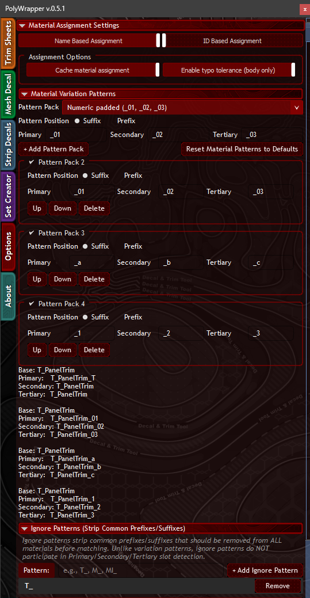
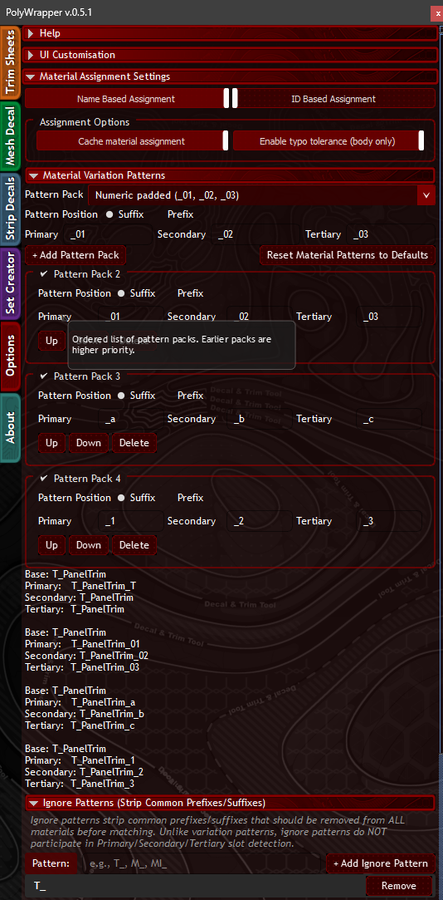

# Material Matching

PolyWrapper automatically matches your scene materials to loaded asset sets using a token-based scoring system. When you load a trim or decal set, the tool scans your scene's materials and assigns the best match — so your textures show up correctly without manual material ID setup.

## Assignment Modes

Toggle between two matching strategies in the **Material Assignment Settings** section of the Options tab:

| Mode | Description |
|------|-------------|
| **Name Based Assignment** | Matches materials by comparing names using token scoring (default) |
| **ID Based Assignment** | Matches materials by their Material ID number |

### Assignment Options

| Option | Description |
|--------|-------------|
| **Cache material assignment** | Remembers previous matches so switching sets is faster |
| **Enable typo tolerance (body only)** | Allows fuzzy matching for slight spelling differences in material names |

## How Name-Based Matching Works

The system follows these processing steps:

1. **CamelCase Splitting** — `MeshDecals` becomes `Mesh_Decals`
2. **Normalization** — Lowercase and tokenize into individual words: `[mesh, decals]`
3. **Ignore Pattern Stripping** — Remove noise prefixes like `T_`: `[mesh, decals]`
4. **Variation Pattern Stripping** — Remove slot indicators like `_a`, `_b`, `_c`: `[mesh, decals]`
5. **Scoring** — Compare token overlap between set name and material slots

### Confidence Levels

| Level | Meaning |
|-------|---------|
| **Confident** | Clear winner — one material scores significantly higher than all others |
| **Low** | Near-tie — two or more materials have similar scores. Check the result |
| **No Match** | No material scored above the minimum threshold |

## Material Variation Patterns

Variation patterns tell PolyWrapper how to identify which sub-material slot (Primary, Secondary, Tertiary) a material belongs to. These are configured in the **Material Variation Patterns** section of the Options tab.

### Pattern Packs

Each pattern pack defines suffix or prefix markers for the three material slots:

| Pattern Pack | Primary | Secondary | Tertiary | Example |
|-------------|---------|-----------|----------|---------|
| **Numeric padded** | `_01` | `_02` | `_03` | `T_PanelTrim_01`, `T_PanelTrim_02` |
| **Numeric** | `_1` | `_2` | `_3` | `T_PanelTrim_1`, `T_PanelTrim_2` |
| **Alphabetic** | `_a` | `_b` | `_c` | `T_PanelTrim_a`, `T_PanelTrim_b` |
| **Suffixed T** | `_T` | `_T` | `_T` | Uses naming context |

Each pack can be set to **Suffix** (appended to the end) or **Prefix** (prepended to the start). You can add, reorder, or delete pattern packs.

### Managing Pattern Packs

- Click **+ Add Pattern Pack** to create a new pattern
- Use **Up / Down** buttons to change priority order
- Click **Delete** to remove a pack
- Click **Reset Material Patterns to Defaults** to restore the built-in packs

## Ignore Patterns (Strip Common Prefixes/Suffixes)

Ignore patterns strip common prefixes or suffixes that add noise to matching. Unlike variation patterns, ignore patterns do **not** participate in Primary/Secondary/Tertiary slot detection — they are simply removed from all material names before scoring.

For example, adding `T_` as an ignore pattern means `T_PanelTrim_a` is processed as `PanelTrim_a` before matching.

To manage ignore patterns:
- Type a pattern in the field and click **+ Add Ignore Pattern**
- Click **Remove** next to an existing pattern to delete it

## Material Scoring Breakdown

The scoring breakdown shows:

- Individual token matches with their source
- Token weights and how they contributed to the total score
- Exact match bonuses when material names perfectly match the set name

### Example Walkthrough

For a set named `T_MeshDecals_a` with scene materials `T_PanelTrim_a` and `Scifi_MeshDecals`:

**Processing `T_MeshDecals_a`:**
1. Split CamelCase: `T_Mesh_Decals_a`
2. Strip `T_` (ignore): `Mesh_Decals_a`
3. Strip `_a` (variation): `Mesh_Decals`
4. Tokenize: `[mesh, decals]`

**Matching against `T_PanelTrim_a`:** `[panel, trim]` — 0/2 tokens match — Score: 0%

**Matching against `Scifi_MeshDecals`:** `[scifi, mesh, decals]` — 2/2 base tokens found — Score: 100%

## Tips for Best Results

- **Use descriptive material names** that reflect content (e.g. `MeshDecals`, `PanelTrim`)
- **Add common prefixes** like `T_` and `M_` to ignore patterns
- **Use CamelCase** for better token separation (`PanelTrim` splits better than `paneltrim`)
- **Variation patterns** (`_a`, `_b`, `_c`) identify which slot is Primary/Secondary/Tertiary

---

[[Home]] | [[Set-Creator|Set Creator]] | [[Trim-Sheet|Trim Sheet]]
