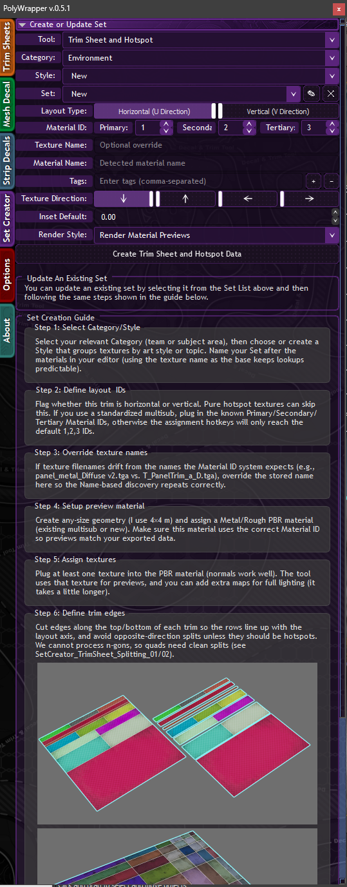
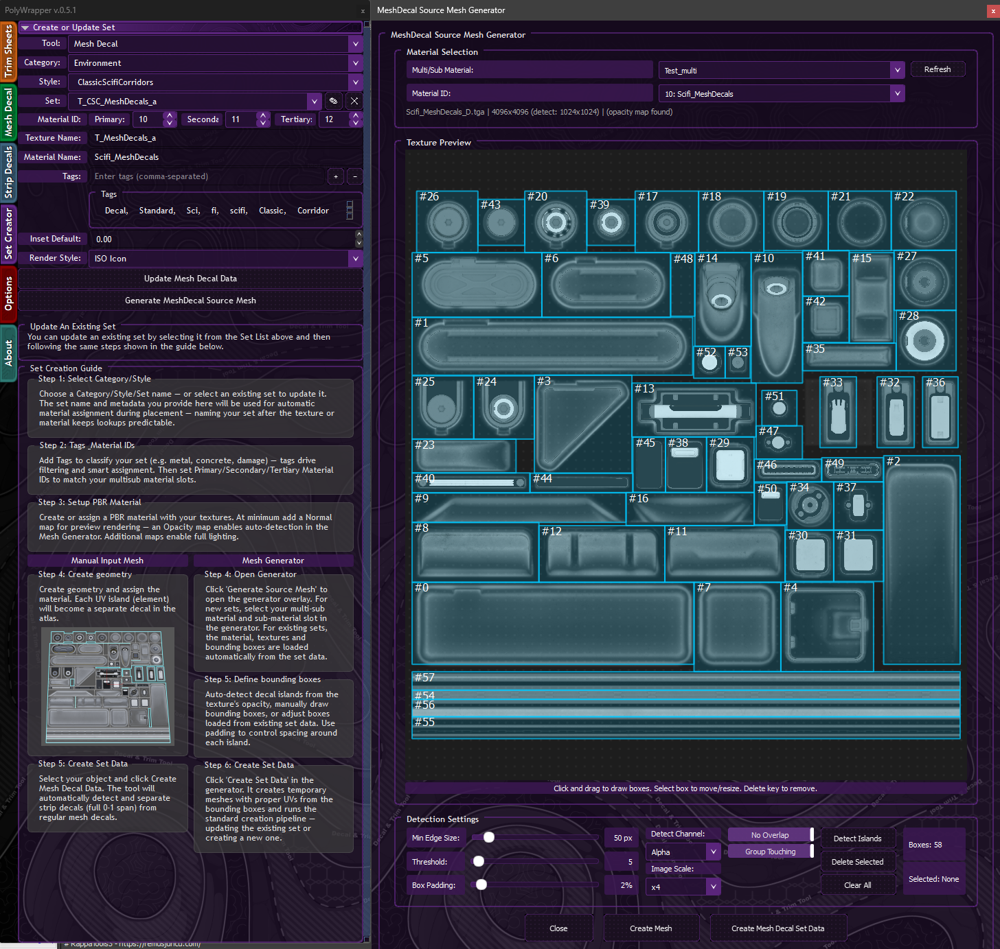

# Set Creator

The Set Creator lets you build and manage your own decal and trim sheet asset libraries. You can create sets from existing meshes or use the Mesh Generator to automatically detect decal shapes from textures.



## Asset Tree Structure

Sets are organized in a three-level hierarchy:

```
Category / Style / Set
```

For example: `Environment / Generic / T_Concrete_hs_a`

Each set lives in its own folder containing JSON metadata, icon previews, and references to the source material.

## Create or Update Set

The creation form at the top of the tab defines all metadata for your set:

| Field | Description |
|-------|-------------|
| **Tool** | What the set is for — *Trim Sheet and Hotspot* or *Mesh Decal* |
| **Category** | Top-level group (e.g. Environment, Characters) |
| **Style** | Sub-group within the category |
| **Set** | The set name — select an existing set to update, or type a new name |
| **Layout Type** | **Horizontal (U Direction)** or **Vertical (V Direction)** — how trims are oriented on the texture |
| **Material ID** | Primary, Secondary, and Tertiary material IDs used by the set |
| **Texture Name** | Optional override for the texture filename |
| **Material Name** | Auto-detected from your scene material, or manually entered |
| **Tags** | Comma-separated keywords for [[Material-Matching|material matching]] and search |
| **Texture Direction** | Arrow buttons to set the texture flow direction |
| **Inset Default** | Default hotspot inset value — automatically applied when this set is loaded |
| **Render Style** | How icons are rendered — *Render Material Previews* uses your PBR material |

Click **Create Trim Sheet and Hotspot Data** (or the equivalent for Mesh Decals) to generate the set.

## Updating an Existing Set

Select an existing set from the Set dropdown to load its metadata. Make your changes and click Create again to update it. The guide below the form explains this workflow.

## Set Creation Guide

The Set Creator tab includes a built-in step-by-step guide that walks you through the full creation process. The guide updates dynamically based on whether you're creating a Trim Sheet or Mesh Decal set — follow the numbered steps in the tool to complete your set.

## Mesh Generator

Click **Generate MeshDecal Source Mesh** on the Set Creator tab to open the Mesh Generator overlay.



### Material Selection

At the top of the generator, choose your source material:

| Field | Description |
|-------|-------------|
| **Multi/Sub Material** | Select the Multi/Sub-Object material from your scene |
| **Material ID** | Choose which sub-material slot to use for detection |

The generator shows the texture filename, resolution, and whether an opacity map was found.

### Texture Preview Canvas

The main canvas displays your texture with detected decal regions shown as numbered bounding boxes. You can interact with the canvas directly:

- **Click and drag** to draw new bounding boxes
- **Click a box** to select it
- **Drag a selected box** to move it
- **Drag the edges** of a selected box to resize it
- **Delete key** to remove a selected box

### Detection Settings

| Setting | Description |
|---------|-------------|
| **Min Edge Size** | Minimum size in pixels for detected regions — filters out noise |
| **Threshold** | Sensitivity for shape detection — lower values detect more shapes |
| **Box Padding** | Percentage of padding added around each detected shape |
| **Detect Channel** | Which texture channel to analyze — **Alpha** for opacity-based detection |
| **Image Scale** | Scale factor for the detection pass (e.g. x4) — higher values are more precise but slower |

### Detection Options

| Option | Description |
|--------|-------------|
| **No Overlap** | Automatically resolves overlapping bounding boxes |
| **Group Touching** | Groups adjacent detected regions into single bounding boxes |

### Actions

| Button | Description |
|--------|-------------|
| **Detect Islands** | Run auto-detection on the texture to find decal shapes |
| **Delete Selected** | Remove selected bounding boxes |
| **Clear All** | Remove all bounding boxes |
| **Create Mesh** | Generate mesh geometry from the bounding boxes |
| **Create Mesh Decal Set Data** | Generate meshes and create/update the set data in one step |

### Editing Existing Sets

- Opening the generator with an existing set selected automatically loads its bounding boxes.
- Detection only finds new islands in areas without existing boxes.
- Material names and IDs are preserved when updating.

## Material Name Auto-Detection

When creating sets from Multi/Sub-Object materials, PolyWrapper automatically detects and saves the sub-material names. This ensures renders use the correct material slots from your multi-material setup.

## Set Management

- **Rename** sets — the folder and JSON filenames update automatically, including icon references.
- **Delete** sets with a confirmation prompt.
- Other panels refresh automatically after rename/delete to stay in sync.

## Icon Rendering

The **Render Style** dropdown controls how set preview icons are generated. Each mode has different requirements and produces different results.

| Render Style | Requirements | Description |
|-------------|-------------|-------------|
| **Render Material Previews** | PBR material with 2+ texture maps (e.g. Normal + Roughness) | Renders icons using the Quicksilver hardware renderer with full PBR lighting, ambient occlusion, and shadows. Produces the highest quality previews for materials with multiple maps. Falls back to single-texture rendering if only one map is assigned. |
| **Render Texture Previews** | At least one texture map | Samples icons directly from the source texture without 3D rendering. Fast and lightweight — best when you just need a clean texture crop without lighting. |
| **ISO Icon** | Displacement/height map (required), Mesh Decal type only | Renders each decal individually at a 45-degree isometric angle with displacement geometry applied. Showcases surface relief and depth detail. Slower than other modes since each icon is rendered separately. Not available for Trim Sheet or Strip Decal sets. |

## "All" Category Filter

A special "All" category displays sets from all teams and styles at once, letting you browse your entire library without changing filters. Matching sets automatically resolve to their actual team/style paths.

---

[[Home]] | [[Material-Matching|Material Matching]] | [[Quick-Sets|Quick Sets]]
