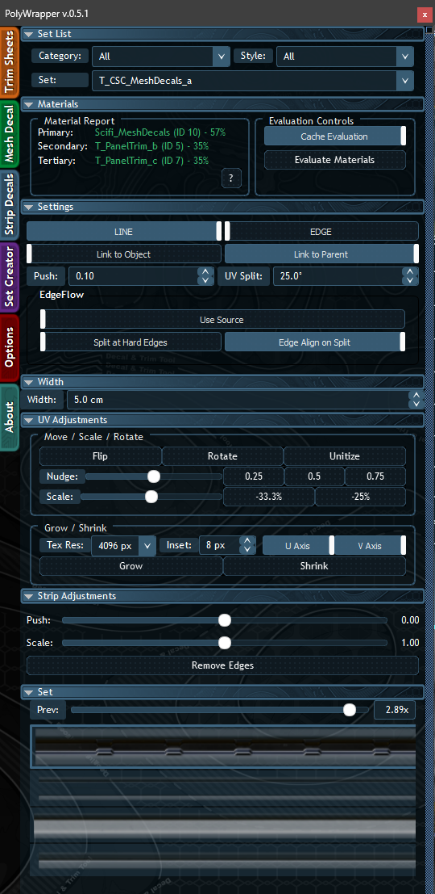
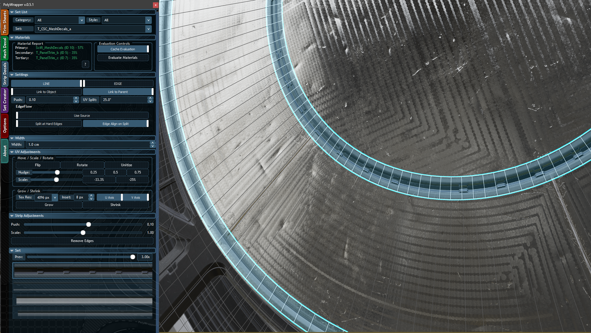

# Strip Decal

The Strip Decal tool creates continuous trim and edge detail meshes that follow selected edges on your geometry. It's ideal for stitching, piping, trim lines, panel gaps, and edge weathering.

## How It Works

1. Select edges on any Editable Poly object.
2. Open the Strip Decal tab.
3. Choose a profile, width, and settings.
4. Click a strip from the set panel to generate — it automatically follows the edge flow and conforms to the surface.

Strips support both **open paths** and **closed loops**.

## Profiles

Toggle between profiles at the top of the Settings panel:

### LINE

A flat, 2-vertex ribbon that sits on the surface. Each segment is a single quad face.

Best for: trim lines, panel gaps, surface details, flat decals.

### EDGE

A 3-vertex beveled edge with each segment creating 2 quad faces. Creates the look of a chamfered or raised edge.

> **Note:** Edge Profile is currently in development and will be available in a future update.

## Settings

| Setting | Description |
|---------|-------------|
| **Push** | Distance to offset the strip from the source surface |
| **UV Split** | Angle threshold for splitting UVs at sharp corners to prevent texture stretching |

### Linking

| Option | Description |
|--------|-------------|
| **Link to Object** | Links the strip to the source object so they move together |
| **Link to Parent** | Links the strip to the source object's parent |

### EdgeFlow

Controls how the strip follows the source mesh edges:

| Option | Description |
|--------|-------------|
| **Use Source** | Strip follows the exact mesh edge directions for precise alignment |
| **Split at Hard Edges** | Splits the strip at edges with hard smoothing group boundaries |
| **Edge Align on Split** | Aligns strip ends to tangent edges at split points |

## Width

Set the strip width in world units (e.g. `5.0 cm`). Choose from preset values in the dropdown or type a custom value.

## UV Adjustments

The Strip Decal tab includes its own [[UV-Adjustments]] panel with the same controls as the Trim Sheet tab — Flip, Rotate, Unitize, Nudge, Scale, Grow, and Shrink. All modifier keys work the same way.

## Strip Adjustments

After creating a strip, use the Strip Adjustments panel to fine-tune it:

| Control | Description |
|---------|-------------|
| **Push** | Slider to adjust the strip's offset from the surface after creation |
| **Scale** | Slider to rescale the strip width after creation |
| **Remove Edges** | Removes the selected edges from the strip |

## UV Features

- **Automatic UV mapping** that maintains proper texel density along the strip length
- **Smart UV splitting** at sharp corners to prevent texture stretching
- **UV compensation** ensures clean texture alignment at corners and strip ends

---

[[Home]] | [[UV-Adjustments|UV Adjustments]] | [[Set-Creator|Set Creator]]
