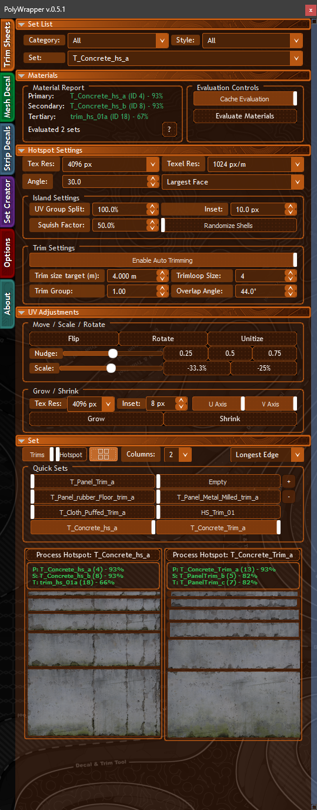

# UV Adjustments

The UV Adjustments panel provides fine-grained control over UV positioning after applying trims or creating strips. It's shared between the Trim Sheet and Strip Decal tabs.

## Controls

| Control | Action | Shift |
|---------|--------|-------|
| **Flip** | Flip UVs on the U-axis | Flip on V-axis |
| **Rotate** | Rotate UVs 90 degrees | — |
| **Unitize** | Normalize UVs on the U-axis | Unitize on V-axis |
| **Nudge** | Move UVs in the positive direction | Nudge on V-axis |
| **Scale** | Scale UVs up | Scale on V-axis |
| **Grow** | Expand UV shell outward (inset-based) | — |
| **Shrink** | Contract UV shell inward (inset-based) | — |

## Modifier Keys

| Key | Effect |
|-----|--------|
| **Shift + click** | Apply the operation on the V-axis instead of U |
| **Right-click** | Inverse operation (nudge opposite direction, scale down instead of up) |
| **Alt + drag** | Fine adjustment mode on sliders |

## Slider Controls

The Nudge and Scale sliders control the magnitude of each operation:

- **Click anywhere** on the slider to start dragging — you don't need to grab the handle precisely.
- **Right-click drag** converts to the inverse operation.
- **Double-click** a slider to reset it.
- Sliders use relative movement for precise control.

## Action Queue

When you click multiple UV operations quickly:

- **Flip**, **Rotate**, **Unitize**, **Grow**, and **Shrink** queue instead of interrupting each other.
- Button labels show queue position (e.g., "Queued (1)", "Queued (2)") when actions are waiting.
- **Nudge** and **Scale** wait until queued actions finish, keeping results consistent and repeatable.

## Smooth Animations

UV transforms animate smoothly by default. You can:

- Toggle animations on/off in the [[Options-and-Theming|Options]] tab.
- Adjust animation speed with the speed slider.
- Switch axis or change values mid-animation without jumps — transitions blend cleanly.

## Decal Object UV Operations

For objects with the `MD_` prefix (mesh decals) or `MDSD_` prefix (strip decals), UV adjustments automatically operate on **all faces** without requiring you to be in face or element sub-object mode. This makes it faster to tweak UVs on placed decals.

## Grow / Shrink

Grow and Shrink use texture-resolution-aware inset calculations to expand or contract UV shells. This is useful for adjusting how much of a trim region is visible without changing the trim assignment.

If no valid selection is found when clicking Grow or Shrink, an overlay notification appears instead of a blocking popup.

---

[[Home]] | [[Trim-Sheet|Trim Sheet]] | [[Strip-Decal|Strip Decal]]
